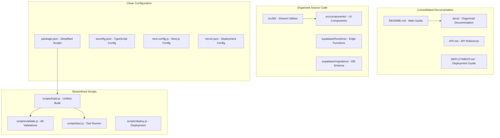

# Codebase Cleanup Design Document

## Overview

The GameCompare.ai codebase has accumulated significant technical debt through rapid development, resulting in duplicated functionality, scattered documentation, redundant scripts, and inconsistent file organization. This design outlines a comprehensive cleanup strategy to streamline the codebase while preserving all essential functionality and improving maintainability.

## Architecture

### Current State Analysis

The codebase currently contains:
- **47 documentation files** with overlapping content and inconsistent structure
- **15+ build/validation scripts** with duplicated functionality
- **Multiple security implementations** (both .js and .ts versions)
- **Scattered utility functions** across different directories
- **Redundant configuration files** and build artifacts
- **Inconsistent file organization** patterns

### Target State Architecture



## Components and Interfaces

### 1. Documentation Consolidation System

**Purpose**: Merge and organize scattered documentation into a coherent structure

**Components**:
- **Main README**: Comprehensive project overview with quick start
- **docs/ Directory**: Organized documentation by category
- **API Documentation**: Consolidated API reference
- **Deployment Guide**: Single source of deployment truth

**Interface**:
```typescript
interface DocumentationStructure {
  mainReadme: {
    overview: string
    quickStart: string
    architecture: string
    links: DocumentationLink[]
  }
  docsDirectory: {
    api: string
    deployment: string
    security: string
    troubleshooting: string
    development: string
  }
}
```

### 2. Script Consolidation System

**Purpose**: Merge redundant build and validation scripts into unified tools

**Components**:
- **Unified Build Script**: Single script handling all build variations
- **Consolidated Validator**: All validation checks in one tool
- **Integrated Test Runner**: Unified testing across all test types
- **Deployment Manager**: Single deployment script for all environments

**Interface**:
```typescript
interface ScriptSystem {
  build: {
    development: () => Promise<void>
    production: () => Promise<void>
    vercel: () => Promise<void>
  }
  validate: {
    typescript: () => Promise<boolean>
    eslint: () => Promise<boolean>
    security: () => Promise<boolean>
    build: () => Promise<boolean>
  }
  test: {
    unit: () => Promise<boolean>
    integration: () => Promise<boolean>
    e2e: () => Promise<boolean>
  }
}
```

### 3. File Organization System

**Purpose**: Reorganize files into logical, consistent directory structures

**Components**:
- **Source Code Organization**: Consistent patterns for components and utilities
- **Configuration Consolidation**: Minimal, focused configuration files
- **Asset Management**: Organized static assets and build outputs
- **Cleanup Automation**: Automated removal of temporary and generated files

**Interface**:
```typescript
interface FileOrganization {
  sourceStructure: {
    components: string[]
    utilities: string[]
    pages: string[]
    styles: string[]
  }
  configFiles: {
    essential: string[]
    consolidated: string[]
    removed: string[]
  }
  cleanupTargets: {
    buildArtifacts: string[]
    temporaryFiles: string[]
    duplicates: string[]
  }
}
```

### 4. Dependency Management System

**Purpose**: Optimize and clean up project dependencies

**Components**:
- **Dependency Audit**: Identify unused and duplicate dependencies
- **Version Consolidation**: Ensure consistent versions across packages
- **Dev/Prod Separation**: Proper categorization of dependencies
- **Security Updates**: Update vulnerable packages

**Interface**:
```typescript
interface DependencyManagement {
  audit: {
    unused: string[]
    duplicates: string[]
    outdated: string[]
    vulnerable: string[]
  }
  optimization: {
    consolidate: () => Promise<void>
    update: () => Promise<void>
    categorize: () => Promise<void>
  }
}
```

## Data Models

### Cleanup Configuration

```typescript
interface CleanupConfig {
  documentation: {
    consolidateInto: string
    removeFiles: string[]
    preserveFiles: string[]
  }
  scripts: {
    mergeInto: string
    removeScripts: string[]
    newScripts: Record<string, string>
  }
  files: {
    moveOperations: Array<{
      from: string
      to: string
    }>
    deleteFiles: string[]
    preservePatterns: string[]
  }
  dependencies: {
    remove: string[]
    update: string[]
    consolidate: Record<string, string>
  }
}
```

### Cleanup Report

```typescript
interface CleanupReport {
  timestamp: string
  summary: {
    filesRemoved: number
    filesConsolidated: number
    scriptsSimplified: number
    dependenciesOptimized: number
  }
  operations: Array<{
    type: 'remove' | 'consolidate' | 'move' | 'update'
    source: string
    target?: string
    reason: string
  }>
  metrics: {
    beforeSize: number
    afterSize: number
    spaceSaved: number
    complexityReduction: number
  }
}
```

## Error Handling

### Cleanup Safety Measures

1. **Backup Creation**: Automatic backup of all files before cleanup
2. **Rollback Capability**: Ability to restore previous state if issues occur
3. **Validation Checks**: Ensure functionality remains intact after cleanup
4. **Incremental Processing**: Process cleanup in stages to isolate issues

### Error Recovery

```typescript
interface ErrorRecovery {
  backup: {
    create: () => Promise<string>
    restore: (backupId: string) => Promise<void>
    list: () => Promise<string[]>
  }
  validation: {
    testBuild: () => Promise<boolean>
    testFunctionality: () => Promise<boolean>
    testDeployment: () => Promise<boolean>
  }
  rollback: {
    partial: (operations: string[]) => Promise<void>
    complete: () => Promise<void>
  }
}
```

## Testing Strategy

### Cleanup Validation Tests

1. **Pre-Cleanup Tests**: Capture current functionality state
2. **Post-Cleanup Tests**: Verify all functionality remains intact
3. **Performance Tests**: Ensure cleanup improves or maintains performance
4. **Integration Tests**: Verify all systems work together after cleanup

### Test Categories

```typescript
interface CleanupTests {
  functionality: {
    buildProcess: () => Promise<boolean>
    apiEndpoints: () => Promise<boolean>
    userInterface: () => Promise<boolean>
    deployment: () => Promise<boolean>
  }
  performance: {
    buildTime: () => Promise<number>
    bundleSize: () => Promise<number>
    startupTime: () => Promise<number>
  }
  integrity: {
    configurationValid: () => Promise<boolean>
    dependenciesResolved: () => Promise<boolean>
    scriptsExecutable: () => Promise<boolean>
  }
}
```

## Implementation Phases

### Phase 1: Documentation Consolidation
- Merge overlapping documentation files
- Create organized docs/ directory structure
- Update README with consolidated information
- Remove redundant documentation files

### Phase 2: Script Simplification
- Consolidate build and validation scripts
- Simplify package.json scripts
- Remove duplicate functionality
- Create unified script interfaces

### Phase 3: File Organization
- Reorganize source code structure
- Consolidate configuration files
- Clean up build artifacts and temporary files
- Implement consistent naming patterns

### Phase 4: Dependency Optimization
- Remove unused dependencies
- Update vulnerable packages
- Consolidate duplicate dependencies
- Optimize dev/prod dependency separation

### Phase 5: Validation and Testing
- Run comprehensive test suite
- Validate all functionality works
- Performance benchmarking
- Documentation updates

## Specific Cleanup Targets

### Documentation Files to Consolidate

**High Priority Merges**:
- `DEPLOYMENT.md` + `DEPLOYMENT_READINESS_REPORT.md` → `docs/deployment.md`
- `TROUBLESHOOTING.md` + `TESTING_DEPLOYMENT_FIX.md` → `docs/troubleshooting.md`
- `SECURITY_CHECKLIST.md` + `SECURITY_IMPLEMENTATION.md` → `docs/security.md`
- `API_DOCUMENTATION.md` → `docs/api.md`
- `DATA_INGESTION.md` + `PINECONE_SETUP.md` → `docs/data-management.md`

**Files to Remove**:
- Build reports: `build-config-report.json`, `build-monitor-report.json`, etc.
- Log files: `build-errors.log`, `build-monitor.log`
- Temporary files: `tsconfig.tsbuildinfo`, coverage reports
- Duplicate specs: Consolidate Kiro specs

### Scripts to Consolidate

**Current Scripts (15+)** → **Target Scripts (4)**:
- `scripts/build.js` - Unified build script (replaces 5 build-related scripts)
- `scripts/validate.js` - All validation (replaces 6 validation scripts)
- `scripts/test.js` - Unified testing (replaces 4 test scripts)
- `scripts/deploy.js` - Deployment management (new)

**Remove Duplicate Security Scripts**:
- Keep `scripts/validate-security.ts` (more comprehensive)
- Remove `scripts/validate-security.js` (basic version)

### Configuration Cleanup

**Package.json Script Simplification**:
```json
{
  "scripts": {
    "dev": "next dev",
    "build": "node scripts/build.js",
    "build:production": "node scripts/build.js --production",
    "start": "next start",
    "test": "node scripts/test.js",
    "test:e2e": "node scripts/test.js --e2e",
    "validate": "node scripts/validate.js",
    "deploy": "node scripts/deploy.js",
    "supabase:start": "supabase start",
    "supabase:stop": "supabase stop"
  }
}
```

### File Structure Reorganization

**Target Structure**:
```
├── docs/                    # Consolidated documentation
│   ├── api.md
│   ├── deployment.md
│   ├── security.md
│   ├── troubleshooting.md
│   └── development.md
├── scripts/                 # Simplified scripts
│   ├── build.js
│   ├── validate.js
│   ├── test.js
│   └── deploy.js
├── src/                     # Application source
├── supabase/               # Database and functions
├── cypress/                # E2E tests
├── .kiro/                  # Kiro configuration
└── [essential config files]
```

## Success Metrics

### Quantitative Metrics
- **File Count Reduction**: Target 40% reduction in total files
- **Documentation Consolidation**: 47 files → 5-7 organized files
- **Script Simplification**: 15+ scripts → 4 unified scripts
- **Build Time**: Maintain or improve current build performance
- **Bundle Size**: No increase in production bundle size

### Qualitative Metrics
- **Developer Experience**: Easier navigation and understanding
- **Maintainability**: Clearer code organization and documentation
- **Onboarding**: Faster new developer onboarding
- **Deployment**: Simplified deployment process
- **Testing**: More reliable and comprehensive testing

## Risk Mitigation

### Backup Strategy
- Create full project backup before starting cleanup
- Incremental backups after each major phase
- Git branch for cleanup work with ability to revert

### Validation Strategy
- Comprehensive testing after each cleanup phase
- Automated validation of all functionality
- Performance benchmarking to ensure no regressions
- Manual verification of critical user paths

### Rollback Plan
- Ability to restore from any backup point
- Incremental rollback of specific changes
- Documentation of all changes for selective reversal
- Emergency restoration procedures

This design provides a comprehensive approach to cleaning up the GameCompare.ai codebase while maintaining all essential functionality and improving overall maintainability and developer experience.