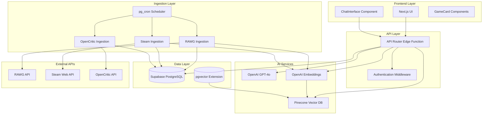

# Design Document

## Overview

GameCompare.ai is a conversational AI platform for game discovery that combines semantic search with large language models to provide intelligent game recommendations. The system architecture leverages existing foundation components including a Supabase PostgreSQL database with pgvector extensions, Next.js frontend, and Deno-based Edge Functions.

The design focuses on completing the missing AI integration layer, data ingestion pipelines, and user-facing chat functionality while maintaining the established architectural patterns and leveraging the existing codebase foundation.

## Architecture

### System Architecture Diagram



### Data Flow

1. **User Query Flow**: User submits chat message → Frontend sends to API Router → Generate query embedding → Search Pinecone for similar games → Retrieve game details from Supabase → Generate GPT response → Stream response to user

2. **Data Ingestion Flow**: Cron triggers ingestion function → Fetch data from external API → Transform and normalize data → Upsert to Supabase → Generate embeddings → Store vectors in Pinecone → Update sync checkpoint

3. **Game Comparison Flow**: User requests comparison → Retrieve both games from database → Generate structured comparison with GPT → Return formatted response

## Components and Interfaces

### Core AI Integration Components

#### GPT Client (`src/lib/gpt.ts`)
```typescript
interface GPTClient {
  generateChatResponse(prompt: string, context: GameContext[]): Promise<string>
  generateComparison(leftGame: Game, rightGame: Game): Promise<string>
  streamResponse(prompt: string, onChunk: (chunk: string) => void): Promise<void>
}

interface GameContext {
  game: Game
  similarity_score: number
}
```

**Responsibilities:**
- Construct contextual prompts using game metadata
- Handle streaming responses for real-time chat experience
- Generate structured comparisons between games
- Implement retry logic with exponential backoff

#### Enhanced Embeddings Service (`src/lib/embeddings.ts`)
The existing embeddings service will be extended with:
```typescript
interface EmbeddingsService {
  processGameEmbedding(game: Game): Promise<void>
  searchSimilarGames(query: string, filters?: FilterState): Promise<GameMatch[]>
  batchProcessEmbeddings(games: Game[]): Promise<void>
}

interface GameMatch {
  game: Game
  similarity_score: number
}
```

**Enhancements:**
- Add batch processing for efficient ingestion
- Implement filtering logic that combines vector search with SQL constraints
- Add error recovery for failed embedding operations

#### API Client (`src/lib/api-client.ts`)
```typescript
interface APIClient {
  searchSimilarGames(query: string, filters?: FilterState): Promise<ChatResponse>
  compareGames(leftId: string, rightId: string): Promise<ComparisonResponse>
  getGameDetails(gameId: string): Promise<Game>
  trackClick(gameId: string, store: string): Promise<void>
}

interface ChatResponse {
  response: string
  games: GameSummary[]
  conversation_id: string
}
```

### Data Ingestion Components

#### RAWG Ingestion Service
```typescript
interface RAWGIngestionService {
  fetchUpdatedGames(since: Date): Promise<RAWGGame[]>
  transformToGameSchema(rawgGame: RAWGGame): Partial<Game>
  processGameBatch(games: RAWGGame[]): Promise<void>
}
```

**Implementation Details:**
- Paginated API fetching with rate limiting (5 requests/second)
- Data transformation mapping RAWG fields to internal schema
- Batch processing with configurable batch sizes (50 games per batch)
- Comprehensive error handling with detailed logging

#### Steam Integration Service
```typescript
interface SteamIngestionService {
  fetchSteamAppDetails(appIds: number[]): Promise<SteamApp[]>
  fetchSteamSpyData(appId: number): Promise<SteamSpyData>
  updateGamePricing(games: Game[]): Promise<void>
}
```

**Implementation Details:**
- Steam Web API integration for app details and pricing
- SteamSpy integration for additional metadata
- Price tracking and historical data storage
- Platform availability detection

#### OpenCritic Integration Service
```typescript
interface OpenCriticService {
  fetchCriticScores(gameTitle: string): Promise<CriticScore>
  updateGameScores(games: Game[]): Promise<void>
  matchGamesByTitle(games: Game[]): Promise<GameScoreMapping[]>
}
```

### Frontend Components

#### Enhanced ChatInterface
```typescript
interface ChatInterfaceProps {
  onMessageSent: (message: string) => void
  messages: ChatMessage[]
  isLoading: boolean
  onGameClick: (gameId: string) => void
}
```

**Features:**
- Real-time streaming response display
- Game card integration within chat messages
- Filter panel for refining searches
- Message history persistence
- Loading states and error handling

#### GameCard Component
```typescript
interface GameCardProps {
  game: GameSummary
  onStoreClick: (gameId: string, store: string) => void
  showComparison?: boolean
}
```

**Features:**
- Store link integration with affiliate tracking
- Price display with currency formatting
- Platform availability indicators
- Quick comparison actions

## Data Models

### Enhanced Game Schema
The existing game schema will be extended with computed fields:
```sql
-- Add computed columns for better search and display
ALTER TABLE games ADD COLUMN search_text tsvector 
  GENERATED ALWAYS AS (
    to_tsvector('english', 
      coalesce(title, '') || ' ' || 
      coalesce(short_description, '') || ' ' || 
      array_to_string(genres, ' ') || ' ' ||
      array_to_string(platforms, ' ')
    )
  ) STORED;

-- Add index for full-text search fallback
CREATE INDEX games_search_text_idx ON games USING gin(search_text);

-- Add price history tracking
CREATE TABLE price_history (
  id uuid PRIMARY KEY DEFAULT gen_random_uuid(),
  game_id uuid REFERENCES games(id) ON DELETE CASCADE,
  store text NOT NULL,
  price_usd numeric NOT NULL,
  recorded_at timestamptz NOT NULL DEFAULT now()
);
```

### Conversation Tracking
```sql
CREATE TABLE conversations (
  id uuid PRIMARY KEY DEFAULT gen_random_uuid(),
  session_id text,
  created_at timestamptz NOT NULL DEFAULT now(),
  updated_at timestamptz NOT NULL DEFAULT now()
);

CREATE TABLE conversation_messages (
  id uuid PRIMARY KEY DEFAULT gen_random_uuid(),
  conversation_id uuid REFERENCES conversations(id) ON DELETE CASCADE,
  role text NOT NULL CHECK (role IN ('user', 'assistant')),
  content text NOT NULL,
  metadata jsonb,
  created_at timestamptz NOT NULL DEFAULT now()
);
```

## Error Handling

### Retry Strategy
```typescript
interface RetryConfig {
  maxAttempts: number
  baseDelay: number
  maxDelay: number
  backoffMultiplier: number
}

const defaultRetryConfig: RetryConfig = {
  maxAttempts: 3,
  baseDelay: 1000,
  maxDelay: 10000,
  backoffMultiplier: 2
}
```

### Error Categories and Handling

1. **API Rate Limits**: Implement exponential backoff with jitter
2. **Network Timeouts**: Retry with increased timeout values
3. **Authentication Failures**: Log and alert, do not retry
4. **Data Validation Errors**: Log details and skip problematic records
5. **Vector Operation Failures**: Fall back to text-based search

### Graceful Degradation

- **Pinecone Unavailable**: Fall back to PostgreSQL full-text search
- **OpenAI API Limits**: Queue requests and process with delays
- **External API Failures**: Continue with cached data, alert operators

## Testing Strategy

### Unit Testing
- **Embedding Generation**: Test with various game metadata formats
- **Data Transformation**: Verify RAWG/Steam/OpenCritic mapping accuracy
- **API Response Formatting**: Ensure TypeScript interface compliance
- **Error Handling**: Test retry logic and fallback mechanisms

### Integration Testing
- **End-to-End Chat Flow**: User query → AI response → game recommendations
- **Data Ingestion Pipeline**: External API → transformation → database storage
- **Vector Search Accuracy**: Query relevance and ranking validation
- **Affiliate Link Tracking**: Click logging and redirect functionality

### Performance Testing
- **Response Latency**: Target <2 seconds for first token
- **Concurrent Users**: Test chat interface under load
- **Batch Processing**: Optimize ingestion throughput
- **Vector Search Speed**: Benchmark Pinecone query performance

### Monitoring and Observability

#### Key Metrics
- **API Response Times**: P50, P95, P99 latencies
- **Error Rates**: By function and error type
- **Data Freshness**: Time since last successful ingestion
- **Vector Search Quality**: Click-through rates on recommendations
- **Affiliate Revenue**: Conversion tracking and revenue attribution

#### Alerting Thresholds
- **Error Rate**: >1% over 5-minute window
- **Response Time**: P95 >5 seconds
- **Ingestion Failures**: Any function failing >3 consecutive runs
- **Vector Index Health**: Pinecone availability and performance

## Security Considerations

### Authentication and Authorization
- **Edge Function Security**: SERVICE_ROLE_KEY validation on all endpoints
- **Rate Limiting**: Implement per-IP and per-session limits
- **Input Validation**: Sanitize all user inputs before processing
- **API Key Management**: Rotate external service keys regularly

### Data Privacy
- **User Query Logging**: Implement configurable retention policies
- **PII Handling**: Ensure no personal information in embeddings
- **Conversation Storage**: Optional persistence with user consent

### Infrastructure Security
- **Environment Variables**: Use Supabase Vault for sensitive configuration
- **Network Security**: Restrict Edge Function access to required services
- **Database Security**: Implement Row Level Security policies
- **Monitoring**: Log security events and suspicious activity patterns