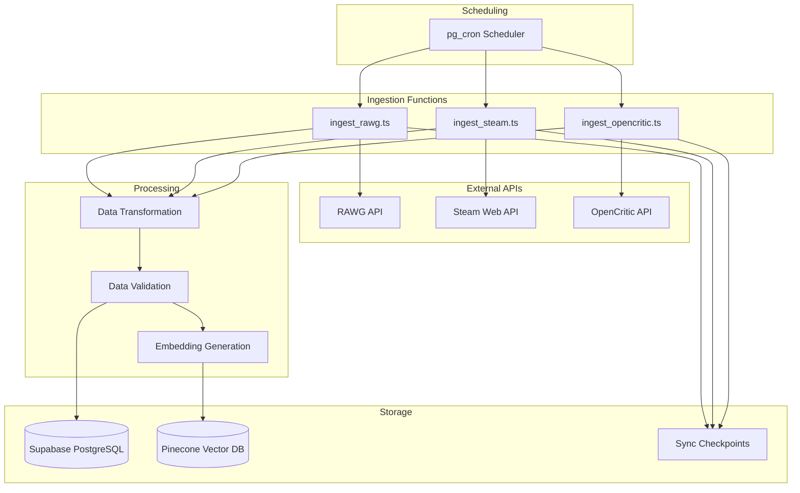

# Data Ingestion Pipeline Documentation

## Overview

GameCompare.ai ingests game data from multiple external sources to provide comprehensive game information for AI-powered recommendations. The system uses automated pipelines that run on scheduled intervals to keep data fresh and accurate.

## Data Sources

### 1. RAWG API
- **Purpose**: Primary game metadata, descriptions, genres, platforms
- **Endpoint**: `https://api.rawg.io/api/games`
- **Rate Limit**: 20,000 requests/month (free tier)
- **Update Frequency**: Daily at 2 AM UTC
- **Key Data**: Game titles, descriptions, genres, platforms, release dates, screenshots

### 2. Steam Web API
- **Purpose**: Pricing, platform availability, user reviews
- **Endpoint**: `https://api.steampowered.com/`
- **Rate Limit**: 100,000 requests/day
- **Update Frequency**: Daily at 3 AM UTC
- **Key Data**: Steam App IDs, current pricing, user review scores, platform availability

### 3. OpenCritic API
- **Purpose**: Professional critic scores and reviews
- **Endpoint**: `https://api.opencritic.com/api/`
- **Rate Limit**: 1,000 requests/day (free tier)
- **Update Frequency**: Weekly on Sundays at 4 AM UTC
- **Key Data**: Critic scores, review counts, recommendation percentages

## Pipeline Architecture



## Ingestion Functions

### RAWG Ingestion (`ingest_rawg.ts`)

**Purpose**: Fetch comprehensive game metadata from RAWG API

**Process Flow**:
1. Check last sync checkpoint
2. Fetch games updated since last sync
3. Transform RAWG data to internal schema
4. Generate embeddings for new/updated games
5. Upsert data to database
6. Update sync checkpoint

**Key Features**:
- Pagination handling (40 games per request)
- Rate limiting (5 requests/second)
- Incremental updates based on `updated` timestamp
- Comprehensive error handling with retry logic
- Batch processing for efficiency

**Data Transformation**:
```typescript
function mapRawgToRow(rawgGame: RAWGGame): Partial<Game> {
  return {
    rawg_id: rawgGame.id,
    title: rawgGame.name,
    release_date: rawgGame.released,
    genres: rawgGame.genres?.map(g => g.name) || [],
    platforms: rawgGame.platforms?.map(p => p.platform.name) || [],
    short_description: rawgGame.description_raw || rawgGame.description,
    updated_at: new Date().toISOString()
  }
}
```

**Manual Execution**:
```bash
# Trigger RAWG ingestion
supabase functions invoke ingest_rawg

# Check logs
supabase functions logs ingest_rawg --follow
```

### Steam Ingestion (`ingest_steam.ts`)

**Purpose**: Update pricing and platform availability from Steam

**Process Flow**:
1. Fetch games with Steam App IDs from database
2. Query Steam Web API for app details
3. Fetch additional data from SteamSpy
4. Update pricing and platform information
5. Track price changes in price_history table

**Key Features**:
- Batch processing (100 apps per request)
- Price history tracking
- Platform availability detection
- User review score integration
- Error handling for missing/removed games

**Data Updates**:
```typescript
interface SteamUpdate {
  price_usd: number
  platforms: string[]
  steam_score: number
  steam_reviews: number
}
```

**Manual Execution**:
```bash
# Trigger Steam ingestion
supabase functions invoke ingest_steam

# Check price history
SELECT * FROM price_history WHERE game_id = 'your-game-id' ORDER BY recorded_at DESC;
```

### OpenCritic Ingestion (`ingest_opencritic.ts`)

**Purpose**: Update professional critic scores

**Process Flow**:
1. Fetch games without recent critic scores
2. Search OpenCritic by game title
3. Match games using title similarity and Steam App ID
4. Update critic scores and review counts
5. Handle ambiguous matches gracefully

**Key Features**:
- Fuzzy title matching
- Steam App ID cross-reference
- Batch processing to respect rate limits
- Confidence scoring for matches
- Manual review flagging for uncertain matches

**Matching Logic**:
```typescript
function calculateMatchConfidence(
  gameTitle: string, 
  criticGame: OpenCriticGame
): number {
  const titleSimilarity = stringSimilarity(gameTitle, criticGame.name)
  const steamMatch = gameTitle.steam_appid === criticGame.steamAppId ? 0.3 : 0
  return titleSimilarity + steamMatch
}
```

## Scheduling Configuration

### pg_cron Setup
```sql
-- Enable pg_cron extension
CREATE EXTENSION IF NOT EXISTS pg_cron;

-- Schedule RAWG ingestion (daily at 2 AM UTC)
SELECT cron.schedule(
  'rawg-ingestion',
  '0 2 * * *',
  'SELECT net.http_post(
    url := ''https://your-project.supabase.co/functions/v1/ingest_rawg'',
    headers := ''{"Authorization": "Bearer ' || current_setting('app.service_role_key') || '"}''
  );'
);

-- Schedule Steam ingestion (daily at 3 AM UTC)
SELECT cron.schedule(
  'steam-ingestion',
  '0 3 * * *',
  'SELECT net.http_post(
    url := ''https://your-project.supabase.co/functions/v1/ingest_steam'',
    headers := ''{"Authorization": "Bearer ' || current_setting('app.service_role_key') || '"}''
  );'
);

-- Schedule OpenCritic ingestion (weekly on Sundays at 4 AM UTC)
SELECT cron.schedule(
  'opencritic-ingestion',
  '0 4 * * 0',
  'SELECT net.http_post(
    url := ''https://your-project.supabase.co/functions/v1/ingest_opencritic'',
    headers := ''{"Authorization": "Bearer ' || current_setting('app.service_role_key') || '"}''
  );'
);
```

### Monitoring Scheduled Jobs
```sql
-- View scheduled jobs
SELECT * FROM cron.job;

-- View job run history
SELECT * FROM cron.job_run_details ORDER BY start_time DESC LIMIT 10;

-- Check for failed jobs
SELECT * FROM cron.job_run_details 
WHERE status = 'failed' 
ORDER BY start_time DESC;
```

## Data Quality & Validation

### Validation Rules
1. **Required Fields**: Title, RAWG ID must be present
2. **Data Types**: Numeric fields validated for proper format
3. **Date Validation**: Release dates must be valid dates
4. **Array Fields**: Genres and platforms must be valid arrays
5. **Price Validation**: Prices must be non-negative numbers

### Data Cleaning
```typescript
function cleanGameData(game: Partial<Game>): Partial<Game> {
  return {
    ...game,
    title: game.title?.trim(),
    genres: game.genres?.filter(g => g && g.trim()),
    platforms: game.platforms?.filter(p => p && p.trim()),
    price_usd: Math.max(0, game.price_usd || 0),
    critic_score: game.critic_score ? Math.min(100, Math.max(0, game.critic_score)) : null
  }
}
```

### Duplicate Detection
```sql
-- Find potential duplicates by title similarity
SELECT g1.id, g1.title, g2.id, g2.title, 
       similarity(g1.title, g2.title) as sim
FROM games g1, games g2 
WHERE g1.id < g2.id 
  AND similarity(g1.title, g2.title) > 0.8
ORDER BY sim DESC;
```

## Error Handling & Recovery

### Retry Logic
```typescript
async function withRetry<T>(
  operation: () => Promise<T>,
  maxAttempts: number = 3,
  baseDelay: number = 1000
): Promise<T> {
  for (let attempt = 1; attempt <= maxAttempts; attempt++) {
    try {
      return await operation()
    } catch (error) {
      if (attempt === maxAttempts) throw error
      
      const delay = baseDelay * Math.pow(2, attempt - 1)
      await new Promise(resolve => setTimeout(resolve, delay))
    }
  }
}
```

### Error Categories
1. **Network Errors**: Retry with exponential backoff
2. **Rate Limit Errors**: Wait and retry after rate limit reset
3. **Authentication Errors**: Log and alert, don't retry
4. **Data Validation Errors**: Log details, skip record, continue
5. **Database Errors**: Retry with connection reset

### Recovery Procedures
```bash
# Reset failed ingestion
UPDATE sync_checkpoints 
SET last_run = last_run - INTERVAL '1 day' 
WHERE source = 'rawg';

# Reprocess specific date range
supabase functions invoke ingest_rawg --data '{"startDate": "2024-01-01", "endDate": "2024-01-02"}'

# Clear corrupted data
DELETE FROM games WHERE updated_at > '2024-01-17' AND title IS NULL;
```

## Performance Optimization

### Batch Processing
- **RAWG**: 40 games per API request, 10 requests per batch
- **Steam**: 100 apps per API request, 5 requests per batch
- **OpenCritic**: 20 games per batch due to rate limits

### Database Optimization
```sql
-- Indexes for ingestion performance
CREATE INDEX CONCURRENTLY idx_games_rawg_id ON games(rawg_id);
CREATE INDEX CONCURRENTLY idx_games_updated_at ON games(updated_at);
CREATE INDEX CONCURRENTLY idx_games_steam_appid ON games(steam_appid) WHERE steam_appid IS NOT NULL;

-- Partial indexes for common queries
CREATE INDEX CONCURRENTLY idx_games_recent ON games(updated_at) 
WHERE updated_at > NOW() - INTERVAL '30 days';
```

### Memory Management
```typescript
// Process in chunks to avoid memory issues
const CHUNK_SIZE = 100
for (let i = 0; i < games.length; i += CHUNK_SIZE) {
  const chunk = games.slice(i, i + CHUNK_SIZE)
  await processChunk(chunk)
  
  // Allow garbage collection
  if (i % 1000 === 0) {
    await new Promise(resolve => setTimeout(resolve, 100))
  }
}
```

## Monitoring & Alerting

### Key Metrics
- **Ingestion Success Rate**: >95% successful runs
- **Data Freshness**: <24 hours for RAWG/Steam, <7 days for OpenCritic
- **Processing Time**: <30 minutes per ingestion run
- **Error Rate**: <1% of processed records

### Health Checks
```sql
-- Check data freshness
SELECT 
  source,
  last_run,
  NOW() - last_run as age,
  CASE 
    WHEN source IN ('rawg', 'steam') AND NOW() - last_run > INTERVAL '25 hours' THEN 'STALE'
    WHEN source = 'opencritic' AND NOW() - last_run > INTERVAL '8 days' THEN 'STALE'
    ELSE 'FRESH'
  END as status
FROM sync_checkpoints;

-- Check for ingestion errors
SELECT COUNT(*) as error_count
FROM cron.job_run_details 
WHERE status = 'failed' 
  AND start_time > NOW() - INTERVAL '24 hours';
```

### Alerting Setup
```typescript
// Monitor ingestion health
async function checkIngestionHealth() {
  const staleData = await supabase
    .from('sync_checkpoints')
    .select('*')
    .lt('last_run', new Date(Date.now() - 25 * 60 * 60 * 1000).toISOString())
  
  if (staleData.data?.length > 0) {
    await sendAlert('Data ingestion is stale', staleData.data)
  }
}
```

## Manual Operations

### Force Full Refresh
```bash
# Reset all checkpoints to force full refresh
UPDATE sync_checkpoints SET last_run = '2020-01-01'::timestamptz;

# Trigger all ingestion functions
supabase functions invoke ingest_rawg
supabase functions invoke ingest_steam
supabase functions invoke ingest_opencritic
```

### Selective Refresh
```bash
# Refresh specific game by RAWG ID
supabase functions invoke ingest_rawg --data '{"gameIds": [3328, 4200]}'

# Refresh games from specific date
supabase functions invoke ingest_rawg --data '{"since": "2024-01-01"}'
```

### Data Export/Import
```bash
# Export game data
pg_dump -h localhost -p 54322 -U postgres -t games > games_backup.sql

# Import game data
psql -h localhost -p 54322 -U postgres -d postgres < games_backup.sql
```

## Best Practices

### Development
1. **Test with Small Datasets**: Use `limit` parameters during development
2. **Monitor Rate Limits**: Track API usage to avoid hitting limits
3. **Validate Transformations**: Test data mapping with real API responses
4. **Handle Edge Cases**: Account for missing fields, null values, API changes

### Production
1. **Monitor Continuously**: Set up alerts for failed ingestions
2. **Backup Regularly**: Export critical data before major updates
3. **Version Control**: Track schema changes and data transformations
4. **Document Changes**: Keep ingestion logic well-documented

### Troubleshooting
1. **Check Logs First**: Function logs contain detailed error information
2. **Verify API Keys**: Ensure all external API keys are valid and have sufficient quotas
3. **Test Incrementally**: Isolate issues by testing individual components
4. **Monitor External APIs**: Check status pages for external service outages

## Future Enhancements

### Planned Improvements
- **Real-time Updates**: WebSocket connections for live data updates
- **Machine Learning**: Automated data quality scoring and anomaly detection
- **Additional Sources**: Integration with Epic Games Store, GOG, PlayStation Store
- **Advanced Matching**: ML-based game matching across different platforms
- **Data Lineage**: Track data provenance and transformation history

### Scalability Considerations
- **Horizontal Scaling**: Distribute ingestion across multiple functions
- **Caching Layer**: Redis cache for frequently accessed data
- **Queue System**: Message queues for handling large ingestion volumes
- **Data Partitioning**: Partition large tables by date or source