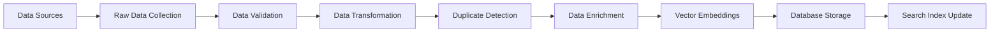

# API Documentation

## Overview

GameCompare.ai provides a comprehensive REST API for game data, AI-powered recommendations, and user interactions. This documentation covers all endpoints, authentication, and integration details.

## Base URL

```
Production: https://gamecompare.ai/api
Development: http://localhost:3000/api
```

## Authentication

### Supabase Authentication

All authenticated endpoints require a valid JWT token from Supabase Auth.

```typescript
// Client-side authentication
import { createClient } from '@supabase/supabase-js'

const supabase = createClient(
  process.env.NEXT_PUBLIC_SUPABASE_URL!,
  process.env.NEXT_PUBLIC_SUPABASE_ANON_KEY!
)

// Get authenticated user
const { data: { user } } = await supabase.auth.getUser()

// Make authenticated API call
const response = await fetch('/api/user/profile', {
  headers: {
    'Authorization': `Bearer ${session.access_token}`,
    'Content-Type': 'application/json'
  }
})
```

## Core Endpoints

### Games API

#### GET /api/games

Retrieve games with filtering and pagination.

**Parameters:**
- `query` (string, optional): Search query
- `genre` (string, optional): Filter by genre
- `platform` (string, optional): Filter by platform
- `limit` (number, optional): Number of results (default: 20, max: 100)
- `offset` (number, optional): Pagination offset (default: 0)
- `sort` (string, optional): Sort order (`rating`, `release_date`, `name`)

**Example Request:**
```bash
curl "https://gamecompare.ai/api/games?query=zelda&genre=action&limit=10"
```

**Example Response:**
```json
{
  "data": [
    {
      "id": "game_123",
      "name": "The Legend of Zelda: Breath of the Wild",
      "description": "An open-world action-adventure game...",
      "genre": ["Action", "Adventure"],
      "platforms": ["Nintendo Switch", "Wii U"],
      "release_date": "2017-03-03",
      "rating": 97,
      "metacritic_score": 97,
      "steam_rating": null,
      "price": {
        "steam": null,
        "nintendo": 59.99,
        "playstation": null,
        "xbox": null
      },
      "images": {
        "cover": "https://example.com/cover.jpg",
        "screenshots": ["https://example.com/screen1.jpg"]
      },
      "created_at": "2024-01-15T10:30:00Z",
      "updated_at": "2024-01-15T10:30:00Z"
    }
  ],
  "pagination": {
    "total": 150,
    "limit": 10,
    "offset": 0,
    "has_more": true
  }
}
```

### Recommendations API

#### POST /api/recommendations

Get AI-powered game recommendations based on user preferences.

**Request Body:**
```json
{
  "user_id": "user_123",
  "preferences": {
    "genres": ["Action", "RPG"],
    "platforms": ["PC", "PlayStation 5"],
    "max_price": 60,
    "rating_threshold": 80
  },
  "context": {
    "mood": "relaxing",
    "session_length": "long",
    "multiplayer": false
  },
  "exclude_owned": true,
  "limit": 10
}
```

**Response:**
```json
{
  "data": {
    "recommendations": [
      {
        "game_id": "game_456",
        "confidence_score": 0.92,
        "reasoning": "Based on your love for open-world games and high ratings...",
        "match_factors": ["genre", "rating", "gameplay_style"]
      }
    ],
    "explanation": "These recommendations are based on your gaming history and preferences...",
    "generated_at": "2024-01-15T10:30:00Z"
  }
}
```

## Data Management

### Data Ingestion Pipeline

GameCompare.ai uses an automated data ingestion pipeline to collect and process game data from multiple sources.

#### Data Sources

1. **RAWG API** - Primary game database
2. **Steam API** - Steam-specific data and pricing
3. **Metacritic** - Review scores and critic ratings
4. **IGDB** - Additional game metadata
5. **Manual Curation** - Editorial content and corrections

#### Ingestion Process



### Vector Search & AI Integration

#### Pinecone Setup

GameCompare.ai uses Pinecone for vector-based similarity search and AI-powered recommendations.

**Environment Configuration:**
```bash
PINECONE_API_KEY=your_pinecone_api_key
PINECONE_ENVIRONMENT=your_pinecone_environment
PINECONE_INDEX_NAME=gamecompare-embeddings
```

**Index Configuration:**
```typescript
// Pinecone index setup
import { PineconeClient } from '@pinecone-database/pinecone'

const pinecone = new PineconeClient()

await pinecone.init({
  apiKey: process.env.PINECONE_API_KEY!,
  environment: process.env.PINECONE_ENVIRONMENT!
})

// Create index (run once)
await pinecone.createIndex({
  createRequest: {
    name: 'gamecompare-embeddings',
    dimension: 1536, // OpenAI embedding dimension
    metric: 'cosine',
    pods: 1,
    replicas: 1,
    pod_type: 'p1.x1'
  }
})
```

## Error Handling

### Standard Error Response Format

All API endpoints return errors in a consistent format:

```json
{
  "error": {
    "code": "VALIDATION_ERROR",
    "message": "Invalid request parameters",
    "details": {
      "field": "query",
      "reason": "Query parameter is required"
    },
    "timestamp": "2024-01-15T10:30:00Z",
    "request_id": "req_123456"
  }
}
```

### Error Codes

| Code | HTTP Status | Description |
|------|-------------|-------------|
| `VALIDATION_ERROR` | 400 | Invalid request parameters |
| `UNAUTHORIZED` | 401 | Authentication required |
| `FORBIDDEN` | 403 | Insufficient permissions |
| `NOT_FOUND` | 404 | Resource not found |
| `RATE_LIMITED` | 429 | Too many requests |
| `INTERNAL_ERROR` | 500 | Server error |
| `SERVICE_UNAVAILABLE` | 503 | External service unavailable |

## Rate Limiting

### Rate Limits by Endpoint

| Endpoint | Authenticated | Anonymous |
|----------|---------------|-----------|
| `/api/games` | 1000/hour | 100/hour |
| `/api/search` | 500/hour | 50/hour |
| `/api/recommendations` | 200/hour | 20/hour |
| `/api/user/*` | 1000/hour | N/A |

## Support

### API Support

- **Documentation**: This API documentation
- **Status Page**: https://status.gamecompare.ai
- **Support Email**: api-support@gamecompare.ai

### Bug Reports

Report API bugs with:
- Endpoint URL and method
- Request/response examples
- Error messages and codes
- Timestamp of the issue